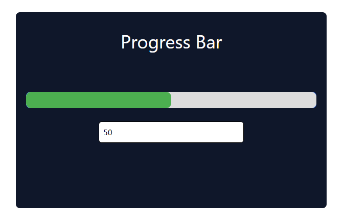

# Progress Bar Project

## 📌 Introduction
This is a simple **React** project that demonstrates a progress bar where users can input a value to change its progress dynamically.

## 🚀 Technologies Used
- **React** (with Vite)
- **Tailwind CSS** for styling

## 📂 Project Structure
```
├── src/
│   ├── App.jsx  # Main component
│   ├── App.css  # Styling
│   ├── assets/
│   │   ├── react.svg
│   │   ├── vite.svg
│   ├── main.jsx  # React entry point
│
├── index.html
├── package.json
├── vite.config.js
```

## 📥 Installation & Setup
To run the project locally, follow these steps:

1️⃣ **Clone the repository:**
```sh
git clone https://github.com/MohammadEdrisnezami/progress-bar-app.git
cd progress-bar-app
```

2️⃣ **Install dependencies:**
```sh
npm install
```

3️⃣ **Run the project:**
```sh
npm run dev
```

## 🎨 Features
✅ Styled with Tailwind CSS  
✅ Dynamically updates progress bar value  
✅ Responsive design  

## 📸 Screenshot



## 💡 How It Works
- The user enters a number in the input field.
- The progress bar updates dynamically to match the entered value.
- If the value exceeds `100`, it resets to `0`.

## 🔗 Contributing
Feel free to fork this project and submit a pull request if you have improvements! 😊

---
📌 **Author:** Mohammad Edris nezami 
📅 **Date:** March 2025

